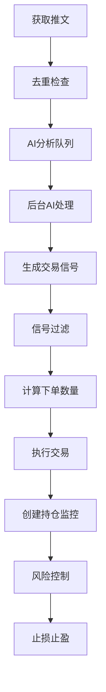

# Trading Bot 项目介绍

## 项目概述

**Trading Bot** 是一个基于社交媒体信号（主要为Twitter推文）的加密货币自动化交易系统。系统通过实时监控特定KOL（意见领袖）的推文，利用AI分析提取交易信号，并自动执行币安（Binance）合约交易，实现从信息获取到交易执行的完整闭环。

## 核心业务价值

这个项目解决了传统量化交易中的一个关键痛点：**信息差**。通过AI理解自然语言中的交易意图，系统能够：

1. **第一时间捕捉市场影响者的交易观点** - 获取信息优势
2. **消除人工干预延迟** - 实现秒级响应
3. **集成风险控制** - 保护交易本金
4. **完整记录追踪** - 便于后续分析和优化

## 技术架构

项目采用**分层架构**设计，各层职责清晰：

```
┌─────────────────────────────────────────────────────────────┐
│                    应用层 (Application Layer)                │
│  ┌─────────────┐  ┌─────────────┐  ┌─────────────────────┐ │
│  │   main.py   │  │ app_runner.py│  │  TradingAppContext  │ │
│  │  (入口)     │  │(主编排逻辑)  │  │   (应用上下文)       │ │
│  └─────────────┘  └─────────────┘  └─────────────────────┘ │
└─────────────────────────────────────────────────────────────┘
┌─────────────────────────────────────────────────────────────┐
│                    核心层 (Core Layer)                       │
│  ┌─────────────┐  ┌─────────────┐  ┌─────────────────────┐ │
│  │   domain.py │  │  signals.py │  │   risk_exit.py      │ │
│  │(领域模型)   │  │(信号抽象)   │  │   (风控管理)        │ │
│  └─────────────┘  └─────────────┘  └─────────────────────┘ │
└─────────────────────────────────────────────────────────────┘
┌─────────────────────────────────────────────────────────────┐
│                  适配器层 (Adapter Layer)                    │
│  ┌─────────────┐  ┌──────────────┐  ┌────────────────────┐ │
│  │twitter_src.py│  │exchange_*.py │  │ tweet_analyzer.py  │ │
│  │(数据源适配)  │  │(交易所适配)  │  │   (AI分析适配)      │ │
│  └─────────────┘  └──────────────┘  └────────────────────┘ │
└─────────────────────────────────────────────────────────────┘
┌─────────────────────────────────────────────────────────────┐
│                基础设施层 (Infrastructure Layer)             │
│  ┌─────────────┐  ┌──────────────┐  ┌────────────────────┐ │
│  │   config.py │  │   network.py │  │ tweet_record_mngr.py││
│  │(配置管理)   │  │(网络工具)    │  │   (持久化)          │ │
│  └─────────────┘  └──────────────┘  └────────────────────┘ │
└─────────────────────────────────────────────────────────────┘
```

## 核心工作流程



## 关键模块详解

### 1. 数据获取层 (`twitter_source.py`)
- **功能**：从Twitter API或本地JSON文件获取推文
- **特点**：支持本地测试和API生产两种模式切换
- **存储**：推文按用户分别存储为JSONL格式

### 2. AI分析层 (`tweet_analyzer.py`)
- **功能**：调用AI模型分析推文内容，提取交易意图
- **AI模型**：使用Poe API（兼容OpenAI格式）
- **输出**：交易币种、方向、置信度等结构化数据

### 3. 信号处理层 (`app_runner.py`)
- **核心**：`TwitterCrawlerSignalSource`类，实现异步队列处理
- **特点**：
  - 3个后台Worker并发处理AI分析
  - 主循环不被AI调用阻塞，保持10秒固定周期
  - 完整的状态管理和重试机制

### 4. 交易执行层 (`exchange_binance_async.py`)
- **功能**：封装币安API，提供异步交易接口
- **支持**：现货查询、合约下单、杠杆设置等
- **安全**：支持模拟模式(dry_run)和实盘模式切换

### 5. 风险管理层 (`risk_exit.py`)
- **功能**：持仓监控、止损止盈执行
- **策略**：支持固定止损和分批止盈
- **监控**：每秒轮询价格，触发条件时自动平仓

### 6. 记录管理层 (`tweet_record_manager.py`)
- **功能**：推文处理全生命周期记录
- **存储**：内存+文件双存储，支持断点续传
- **字段**：AI结果、过滤状态、交易信息等完整记录

### 7. 信号过滤层 (`signal_filter.py`)
- **功能**：基于黑名单和置信度过滤信号
- **规则**：币种黑名单、最低置信度阈值
- **输出**：详细的过滤结果和原因

## 配置系统 (`config.py`)

项目采用分层配置结构：

```python
AppConfig
├── ai: AIConfig                     # AI配置
├── exchange: ExchangeConfig          # 交易所配置
├── risk: RiskConfig                  # 风控配置
├── twitter_api: TwitterAPIConfig     # 推特API配置
└── trading: TradingConfig            # 交易通用配置
```

支持环境变量覆盖，便于不同环境部署。

## 数据流详解

1. **推文获取**：每10秒轮询一次，获取最新推文
2. **去重处理**：基于tweet_id避免重复处理
3. **AI队列**：新推文进入队列，后台Worker处理
4. **信号生成**：AI分析完成后生成TradeSignal
5. **信号过滤**：检查黑名单和置信度
6. **交易执行**：计算数量并下单
7. **风控启动**：为每个持仓创建监控任务
8. **止盈止损**：监控价格变化，触发条件时平仓

## 关键设计亮点

### 1. 异步队列架构
- AI分析与主循环解耦，互不阻塞
- 3个Worker并发处理，提高吞吐量
- 失败重试机制，最大3次重试

### 2. 完整记录系统
- 每条推文从获取到交易的全过程记录
- 支持断点续传，程序重启不丢失状态
- 便于后续分析和优化

### 3. 灵活的风控系统
- 支持多种出场策略
- 每个持仓独立监控
- 分批止盈保护利润

### 4. 模块化设计
- 各层通过接口解耦，便于扩展
- 适配器模式隔离外部系统
- 配置驱动，避免硬编码

## 部署与运行

### 环境要求
- Python 3.10+
- 网络访问（或代理配置）
- 币安API密钥（实盘模式）

### 运行方式
```bash
# 开发模式（本地JSON数据）
python -m trading_bot.main

# 生产模式（真实API）
python -m trading_bot.main
```

### 配置文件
- `.env`文件：API密钥、代理设置等
- `提示词.txt`：AI分析提示词模板
- `tweet_records.json`：推文处理记录

## 项目优势

1. **实时性**：10秒轮询+异步处理，快速响应市场变化
2. **可靠性**：完整的状态管理和重试机制
3. **可追溯**：全流程记录，便于问题排查和策略优化
4. **可扩展**：清晰的模块边界，便于添加新功能
5. **风险可控**：多层风控机制，保护交易本金

## 当前局限性

1. **内存持仓**：重启后风控任务丢失
2. **固定周期**：10秒轮询，无法动态调整
3. **单交易所**：仅支持币安，扩展其他交易所需开发适配器

## 版本信息

- **当前版本**：v2.0.0
- **最后更新**：2025-11-22
- **主要特性**：异步AI队列、推文记录管理、完整风控系统

这个项目展现了现代量化交易系统的典型架构，通过AI理解自然语言信号，实现了从信息获取到自动交易的完整闭环，是一个功能完整、设计合理的交易机器人系统。