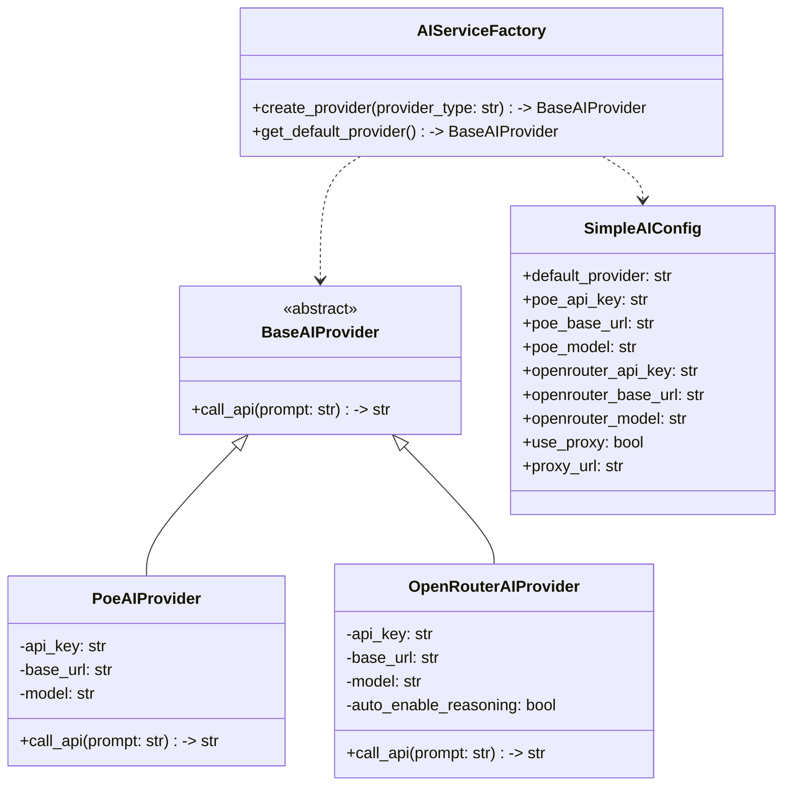

# AI服务层架构设计文档

**版本**: v2.0.0  
**最后更新**: 2025-11-27  
**文档状态**: 设计完成（简化版）

---

## 1. 概述

本文档描述了交易机器人的AI服务层简化架构设计，遵循极简MVP原则，只保留核心功能。

### 1.1 设计目标

- **极简MVP**：只实现必要功能，移除所有复杂性
- **职责单一**：AI服务层只负责调用API和返回原始响应
- **零耦合**：与业务逻辑完全解耦，不做任何数据处理
- **易于维护**：代码结构简单清晰，易于理解和修改

### 1.2 设计原则

- **无降级机制**：移除failover逻辑，不进行备用平台切换
- **无解析逻辑**：JSON解析由调用方处理，AI层只返回原始字符串
- **无提示词处理**：外部已处理好完整prompt，直接传入
- **自动reasoning**：OpenRouter自动启用reasoning_details功能

---

## 2. 架构概述

AI服务层采用极简设计，核心组件包括：

1. **BaseAIProvider抽象接口**：定义统一的AI调用接口
2. **PoeAIProvider实现**：Poe API调用封装
3. **OpenRouterAIProvider实现**：OpenRouter API调用封装（自动启用reasoning）
4. **AIServiceFactory工厂类**：根据配置创建对应的AI实例

---

## 3. 类图



---

## 4. 核心接口定义

### 4.1 BaseAIProvider抽象接口

```python
from abc import ABC, abstractmethod
from typing import Dict, Any

class BaseAIProvider(ABC):
    """AI服务提供者基类，定义统一接口"""
    
    def __init__(self, config: Dict[str, Any]) -> None:
        """初始化AI提供者
        
        Args:
            config: AI平台配置参数
        """
        pass
    
    @abstractmethod
    async def call_api(self, prompt: str) -> str:
        """调用AI API
        
        Args:
            prompt: 完整的提示词字符串（外部已处理好）
            
        Returns:
            AI返回的原始响应字符串
        """
        pass
```

### 4.2 PoeAIProvider实现

```python
import aiohttp
import json
from typing import Dict, Any
from abc import ABC, abstractmethod

class BaseAIProvider(ABC):
    """AI服务提供者基类"""
    
    @abstractmethod
    async def call_api(self, prompt: str) -> str:
        pass

class PoeAIProvider(BaseAIProvider):
    """Poe AI服务提供者实现"""
    
    def __init__(self, config: Dict[str, Any]) -> None:
        self.api_key = config.get("poe_api_key")
        self.base_url = config.get("poe_base_url", "https://api.poe.com/v1/chat/completions")
        self.model = config.get("poe_model", "kimi-k2-thinking")
        self.proxy = config.get("proxy_url") if config.get("use_proxy", False) else None
    
    async def call_api(self, prompt: str) -> str:
        """调用Poe API，返回原始响应字符串"""
        request_data = {
            "model": self.model,
            "messages": [{"role": "user", "content": prompt}],
            "temperature": 0.1
        }
        
        headers = {
            "Authorization": f"Bearer {self.api_key}",
            "Content-Type": "application/json"
        }
        
        async with aiohttp.ClientSession() as session:
            async with session.post(
                self.base_url,
                data=json.dumps(request_data),
                headers=headers,
                proxy=self.proxy,
                timeout=aiohttp.ClientTimeout(total=60)
            ) as response:
                if response.status != 200:
                    raise RuntimeError(f"Poe API错误: {response.status}")
                
                result = await response.json()
                content = result.get("choices", [{}])[0].get("message", {}).get("content")
                
                if not content:
                    raise RuntimeError("AI返回内容为空")
                
                return content
```

### 4.3 OpenRouterAIProvider实现

```python
class OpenRouterAIProvider(BaseAIProvider):
    """OpenRouter AI服务提供者实现（自动启用reasoning）"""
    
    def __init__(self, config: Dict[str, Any]) -> None:
        self.api_key = config.get("openrouter_api_key")
        self.base_url = config.get("openrouter_base_url", "https://openrouter.ai/api/v1/chat/completions")
        self.model = config.get("openrouter_model", "x-ai/grok-4.1-fast:free")
        self.proxy = config.get("proxy_url") if config.get("use_proxy", False) else None
        self.auto_enable_reasoning = True  # 自动启用reasoning功能
    
    async def call_api(self, prompt: str) -> str:
        """调用OpenRouter API，自动启用reasoning_details，返回原始响应字符串"""
        request_data = {
            "model": self.model,
            "messages": [{"role": "user", "content": prompt}],
            "temperature": 0.1
        }
        
        # 自动添加reasoning_details参数
        if self.auto_enable_reasoning:
            request_data["extra_body"] = {"reasoning": {"enabled": True}}
        
        headers = {
            "Authorization": f"Bearer {self.api_key}",
            "Content-Type": "application/json"
        }
        
        async with aiohttp.ClientSession() as session:
            async with session.post(
                self.base_url,
                data=json.dumps(request_data),
                headers=headers,
                proxy=self.proxy,
                timeout=aiohttp.ClientTimeout(total=60)
            ) as response:
                if response.status != 200:
                    raise RuntimeError(f"OpenRouter API错误: {response.status}")
                
                result = await response.json()
                content = result.get("choices", [{}])[0].get("message", {}).get("content")
                
                if not content:
                    raise RuntimeError("AI返回内容为空")
                
                return content
```

### 4.4 AIServiceFactory工厂类

```python
from typing import Dict, Any

class AIServiceFactory:
    """AI服务工厂类，根据配置创建对应的AI实例"""
    
    @staticmethod
    def create_provider(provider_type: str, config: Dict[str, Any]) -> BaseAIProvider:
        """根据类型创建AI提供者实例
        
        Args:
            provider_type: AI提供者类型(poe/openrouter)
            config: AI平台配置
            
        Returns:
            对应的AI提供者实例
        """
        if provider_type == "poe":
            return PoeAIProvider(config)
        elif provider_type == "openrouter":
            return OpenRouterAIProvider(config)
        else:
            raise ValueError(f"不支持的AI提供者类型: {provider_type}")
    
    @staticmethod
    def get_default_provider(config: Dict[str, Any]) -> BaseAIProvider:
        """从配置中获取默认AI提供者"""
        provider_type = config.get("default_provider", "poe")
        return AIServiceFactory.create_provider(provider_type, config)
```

---

## 5. 配置结构

### 5.1 SimpleAIConfig

```python
from dataclasses import dataclass

@dataclass
class SimpleAIConfig:
    """简化的AI配置"""
    
    # 默认AI提供者
    default_provider: str = "poe"
    
    # Poe API配置
    poe_api_key: str = ""
    poe_base_url: str = "https://api.poe.com/v1/chat/completions"
    poe_model: str = "kimi-k2-thinking"
    
    # OpenRouter API配置
    openrouter_api_key: str = ""
    openrouter_base_url: str = "https://openrouter.ai/api/v1/chat/completions"
    openrouter_model: str = "x-ai/grok-4.1-fast:free"
    
    # 代理配置
    use_proxy: bool = False
    proxy_url: str = "http://127.0.0.1:1080"
```

---

## 6. 统一调用接口

### 6.1 简化调用函数

```python
from typing import Dict, Any
from config import load_config

async def call_api(prompt: str, provider: str = None) -> str:
    """统一AI调用接口
    
    Args:
        prompt: 完整的提示词字符串（外部已处理好）
        provider: 指定AI提供者(可选，默认使用配置中的提供者)
        
    Returns:
        AI返回的原始响应字符串
    """
    config = load_config()
    ai_config = config.ai
    
    # 构建配置字典
    provider_config = {
        "poe_api_key": ai_config.poe_api_key,
        "poe_base_url": ai_config.poe_base_url,
        "poe_model": ai_config.poe_model,
        "openrouter_api_key": ai_config.openrouter_api_key,
        "openrouter_base_url": ai_config.openrouter_base_url,
        "openrouter_model": ai_config.openrouter_model,
        "use_proxy": config.proxy.use_proxy_by_default,
        "proxy_url": config.proxy.proxy_url
    }
    
    # 确定提供者类型
    provider_type = provider or "poe"
    
    # 创建AI提供者实例
    ai_provider = AIServiceFactory.create_provider(provider_type, provider_config)
    
    # 调用AI API
    return await ai_provider.call_api(prompt)
```

---

## 7. 使用示例

### 7.1 使用默认AI提供者

```python
from ai_service import call_api

# 外部已处理好完整prompt
prompt = """分析以下推文：
作者：cz_binance
简介：BINANCE创始人
内容：我今天刚刚在币安上用自己的钱买了一些Aster
"""

# 调用AI分析，返回原始响应
result = await call_api(prompt)
print(result)  # 输出原始JSON字符串
```

### 7.2 指定使用OpenRouter

```python
from ai_service import call_api

# 外部已处理好完整prompt
prompt = """分析以下推文：
作者：VitalikButerin
简介：以太坊创始人
内容：ETH 2.0升级即将完成
"""

# 指定使用OpenRouter（自动启用reasoning_details）
result = await call_api(prompt, provider="openrouter")
print(result)  # 输出包含reasoning_details的原始响应
```

---

## 8. 迁移说明

### 8.1 从旧架构迁移

旧架构中的功能处理方式：

1. **JSON解析**：由调用方处理，AI层只返回原始字符串
2. **降级机制**：移除，不再支持备用平台切换
3. **提示词处理**：外部预先处理好完整prompt再传入
4. **错误处理**：保留基本错误处理，但移除复杂重试逻辑

### 8.2 代码迁移示例

**旧代码**：
```python
# 旧代码：AI层处理提示词和解析
result = await analyze_tweet_with_ai(text, author, introduction)
# result已经是解析好的字典
```

**新代码**：
```python
# 新代码：外部处理提示词，AI层只返回原始字符串
prompt = build_prompt(text, author, introduction)  # 外部处理
raw_result = await call_api(prompt)
result = json.loads(raw_result)  # 外部解析
```

---

## 9. 实施建议

### 9.1 文件结构

建议创建以下文件结构：
```
trading_bot/
├── ai_service/
│   ├── __init__.py
│   ├── base_ai_provider.py      # 基础抽象接口
│   ├── poe_ai_provider.py    # Poe实现
│   ├── openrouter_ai_provider.py  # OpenRouter实现（自动reasoning）
│   └── ai_service_factory.py  # 工厂类
├── config.py                   # SimpleAIConfig配置
└── ai_service.py              # 统一调用接口
```

### 9.2 迁移步骤

1. 创建新的AI服务层文件
2. 更新config.py中的AI配置为SimpleAIConfig
3. 在现有代码中逐步替换旧的AI调用
4. 移除旧的tweet_analyzer.py中的直接API调用

---

## 10. 注意事项

### 10.1 OpenRouter reasoning_details

OpenRouter的reasoning_details功能已自动启用，无需手动配置。返回的响应中会自动包含reasoning信息。

### 10.2 错误处理

本设计移除了复杂的降级和重试机制，只保留基本的网络错误处理。调用方需要自行处理API调用失败的情况。

### 10.3 性能考虑

所有AI调用均为异步，不会阻塞主流程。建议设置合理的超时时间（默认60秒）。

---

## 11. 总结

本简化版AI服务层架构设计遵循极简MVP原则，通过以下方式实现了核心功能：

- **接口简化**：统一为`call_api(prompt: str) -> str`
- **职责明确**：只负责API调用，不做任何数据处理
- **自动reasoning**：OpenRouter自动启用reasoning_details功能
- **易于扩展**：通过工厂模式支持未来添加新的AI平台

该架构大幅降低了复杂性，同时保留了必要的功能，代码更加清晰易维护。